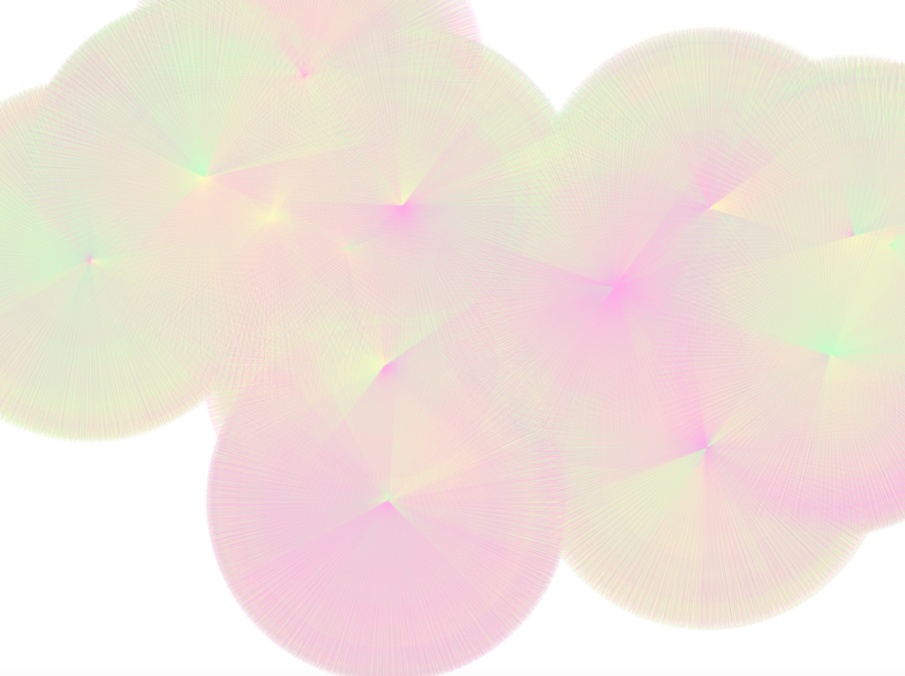
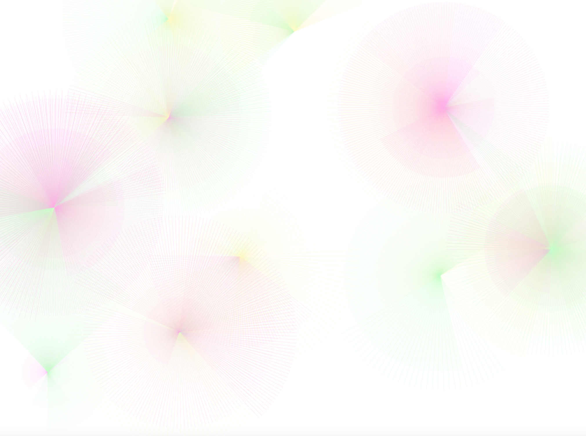
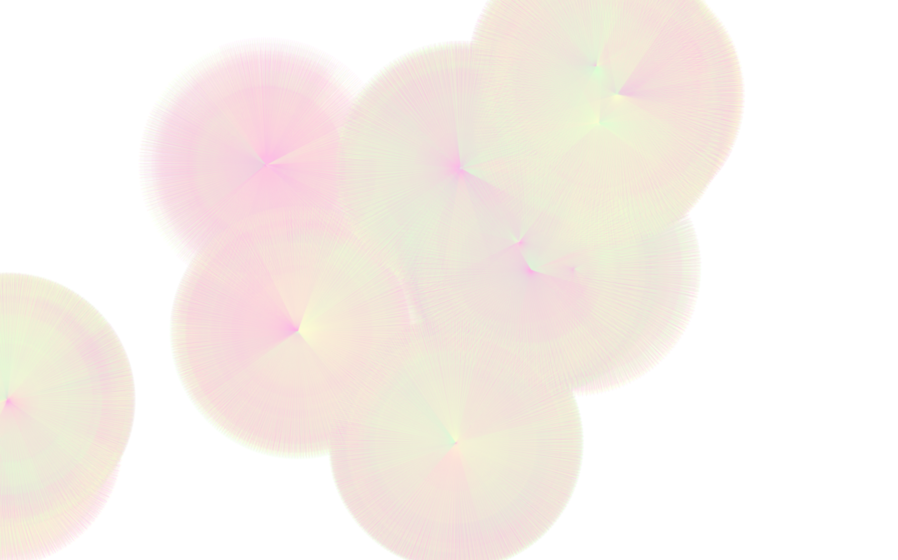

# Project 1: Still
## Blooming

**Description :**

*Blooming* is a generative series of images constructed by randomly layered circles made by lines. This work is inspired by how digital art creates organic images from geometric shapes and therefore forms familiarity with real-world images. I aimed to reproduce the image of flowers blooming in the springtime by converting organic petal shapes into the geometric, digital world. Each layer of digital petals overlays with each other to create a lively and dynamic image of the flower blooming. 

Each time the program is run, the number of layers is randomly decided as well as the center point of each circle. The parameters such as color, radius, and start and end angle are also randomized but based on the experiment to make dynamic and aesthetically pleasing images. To create a blending effect between different circles, I also tuned the opacity based on the radius of each circular sector. While the initial images are generated by the default color scheme, users can also change the colors in real-time using GUI color pickers. 

The creative process started with a basic program that draws circular sectors randomly on the screen. From there, I came up with an algorithm that creates different layers of digital petals on top of each other. After I finalized the basic logic, I tuned each parameter like color, opacity, radius, start and end angle, and layered style by multiple experiments. I also created a custom class to control all the parameters of each petal since there are a lot of specific variables needed for each circular sector. I also added some key actions such as displaying and hiding GUI, taking a screenshot, and toggling a full screen when a specific key is pressed.

One issue I had was that whenever I try to get the screenshot using grabScreen(), the program generates color-reversed images. I still couldn’t resolve this issue so I had to manually take a screenshot of each image.

